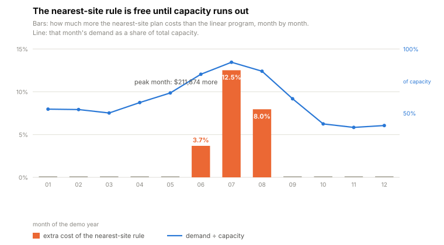
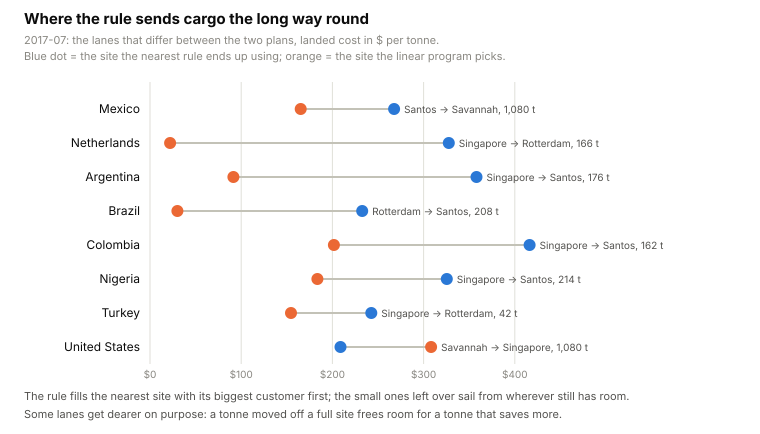
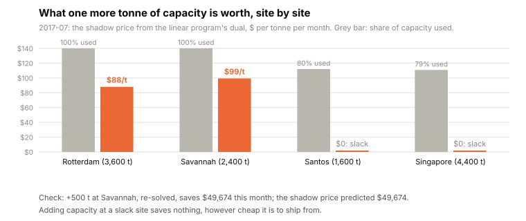
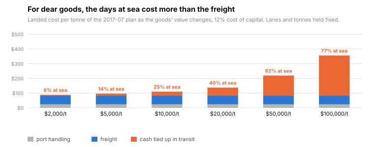

# ship-from

**The nearest plant is the right one to ship from, until the month capacity runs out. Then the habit costs 12.5%, and it cannot tell you which plant to expand.**

[](https://github.com/rikardotoro/ship-from/actions/workflows/ci.yml)

A company with several plants or warehouses and customers on every continent writes a monthly shipping plan. The usual rule is to serve each customer from the nearest site and overflow to the next one when it is full. Most months that rule is also the cheapest plan, because nothing binds. In the months that matter, when demand is close to capacity, it is not: the rule fills the nearest site with its biggest customer first and sends the customers left over from wherever still has room, sometimes around the world.

This tool writes the plan as a transportation linear program instead: every lane priced as port handling plus freight plus the cash tied up while the goods are at sea, every site's capacity as a constraint, every customer's demand as a requirement. The solver is scipy's HiGHS. The by-product is the part a spreadsheet never gives you: a shadow price per site, the value of one more tonne of capacity there, checked in this repo by actually adding the tonne and re-solving.

<picture>
  <source media="(prefers-color-scheme: dark)" srcset="docs/charts/months-dark.svg">
  
</picture>

## The thirty-second version

```
uvx --from git+https://github.com/rikardotoro/ship-from ship-from --demo
```

<!-- BEGIN OUTPUT -->
```
2017-07: 10,763 t to 20 destinations from 4 sites, 90% of capacity
  nearest-site rule  $1,692,649
  linear program     $1,480,775   12.5% less ($211,874) than the rule
  landed cost 138 $/t: handling 17%, freight 43%, cash at sea 40% (goods at $20,000/t, 12% a year)

What the plan moves (tonnes, plan minus rule)
site       United States  Mexico  Brazil  Turkey  Nigeria  Argentina  Netherlands  Colombia
Rotterdam                           -208     +42                             +166          
Savannah          -1,080  +1,080                                                           
Santos                    -1,080    +208             +214       +176                   +162
Singapore         +1,080                     -42     -214       -176         -166      -162

Sites
site       capacity  used  shadow price $/t
Rotterdam     3,600  100%                88
Savannah      2,400  100%                99
Santos        1,600   80%         0 (slack)
Singapore     4,400   79%         0 (slack)
  +500 t at Savannah: saves $49,674 this month (shadow price said up to $49,674)

Every month  (utilisation → gap between rule and plan)
  2017-01   53%    0.0% 
  2017-02   53%    0.0% 
  2017-03   50%    0.0% 
  2017-04   58%    0.0% 
  2017-05   66%    0.0% 
  2017-06   80%    3.7% ████
  2017-07   90%   12.5% █████████████
  2017-08   83%    8.0% ████████
  2017-09   61%    0.0% 
  2017-10   42%    0.0% 
  2017-11   39%    0.0% 
  2017-12   40%    0.0% 

Source: demand from DataCo (CC0), lanes from searoute; sites and costs are stated parameters.
```
<!-- END OUTPUT -->

## Where the rule sends cargo the long way round

The demo network has four sites and twenty destinations. Capacity sits where production is cheap (the largest site is in Asia); demand sits in Europe and the Americas. In the peak month the rule assigns the United States, the largest customer, to its nearest site, which fills it. Mexico, next in line, takes what is left there and overflows to Santos. By the time the Netherlands, Nigeria, Argentina and Colombia are served, the only site with room is Singapore, and they sail from there.

<picture>
  <source media="(prefers-color-scheme: dark)" srcset="docs/charts/moves-dark.svg">
  
</picture>

The program moves 1,080 tonnes of the United States demand *to* Singapore, at $308 a tonne instead of $209, on purpose. That frees Savannah for Mexico, Santos for Nigeria, Argentina and Colombia, and Rotterdam for the Netherlands. The dear lane pays for four cheap ones. No rule that looks at one customer at a time can see that trade, which is why the gap is a property of the month, not of any single lane.

## What a tonne of capacity is worth

The linear program's dual gives a price for every constraint. For a capacity constraint that price is the saving from one more tonne at that site this month. It is zero at a site with room to spare, however cheap it is to ship from, and it is largest at the site whose overflow is costing the most.

<picture>
  <source media="(prefers-color-scheme: dark)" srcset="docs/charts/shadow-dark.svg">
  
</picture>

The tool checks the number the way an auditor would: it adds 500 tonnes at the site with the highest shadow price, re-solves, and reports the realised saving next to the prediction. They match, because the shadow price is exact for small changes and an upper bound for large ones (a test asserts both). The same dual gives a marginal delivered cost per destination, which is the number to hold against a sales price when someone asks whether one more order in that market is worth taking this month.

## The days at sea are a cost line

Freight per tonne is roughly proportional to distance, so the nearest site is usually the cheapest to ship from on freight alone. For goods worth a few thousand dollars a tonne that is the whole story. For goods worth tens of thousands, the capital tied up during a three-week voyage is a cost of the same size as the freight, and the plan should price it.

<picture>
  <source media="(prefers-color-scheme: dark)" srcset="docs/charts/cash-dark.svg">
  
</picture>

In the demo, at $20,000 a tonne and a 12% cost of capital, cash at sea is 40% of the landed cost. The value and the rate are options, so you can put your own goods in.

## Do this in your own tools

**Excel.** The Solver add-in solves this exact problem. Lay out a cost matrix (sites down, destinations across), an allocation matrix of the same shape as the decision cells, a capacity column and a demand row. Objective: `=SUMPRODUCT(costs, allocation)`, minimise. Constraints: each site's row sum ≤ its capacity, each destination's column sum = its demand, allocation ≥ 0. Choose the Simplex LP engine. Shadow prices come from the Sensitivity Report Solver offers after solving: the "Shadow Price" column of the constraints table is the same number this tool prints.

**SQL or DAX.** Neither has a solver. What they can do is the pricing: join sites × destinations to the lane table and compute `handling + freight_per_t_km * km + value * capital_rate / 365 * (sea_days + port_days)` per lane, and the nearest-site allocation as a window function ordered by distance. That gets you the rule's cost and the lane costs; the plan needs an LP.

**Python.** `scipy.optimize.linprog(c, A_ub, b_ub, A_eq, b_eq, method="highs")` is the whole solver call; `res.ineqlin.marginals` are the shadow prices. The plan module in this repo is under a hundred lines.

## Five ways to get this wrong

1. **Trusting the rule because it was right last month.** It is right whenever capacity is slack, which is most months. [`test_month_by_month_gap_is_zero_when_capacity_is_slack`](tests/test_scenarios.py) asserts the gap is zero in every month under 60% utilisation and above 10% in the peak.
2. **Reading a shadow price as a saving you can bank at any scale.** It is exact for one tonne and an upper bound beyond that. [`test_extra_capacity_gain_never_exceeds_shadow_price_times_tonnes`](tests/test_scenarios.py) checks the bound; [`test_shadow_price_equals_finite_difference`](tests/test_plan.py) checks the one-tonne case at every site.
3. **Pricing lanes on freight only.** With the value set to zero the plan is the freight plan. [`test_zero_value_leaves_freight_and_handling_only`](tests/test_cost.py) and [`test_cash_at_sea_is_value_times_rate_times_days`](tests/test_cost.py) pin the two halves of the cost.
4. **Planning a month that cannot be shipped.** When demand exceeds total capacity there is no plan; the tool names the shortfall instead of returning nonsense. [`test_infeasible_month_names_the_shortfall`](tests/test_plan.py); [`test_outage_in_the_peak_month_names_the_shortfall`](tests/test_scenarios.py) covers the outage case.
5. **Believing the optimiser without a null check.** With unlimited capacity the program must simply pick the cheapest lane for every destination. [`test_unlimited_capacity_means_cheapest_lane_per_destination`](tests/test_plan.py) asserts that, and [`test_plan_never_costs_more_than_the_nearest_rule`](tests/test_plan.py) runs both plans for every month.

## Run it

```
uv run ship-from --data FOLDER --month 2024-03
uv run ship-from --demo --month 2017-03 --outage Santos
uv run ship-from --demo --extra Rotterdam=800 --value 45000 --capital-rate 0.09
uv run ship-from --demo --json
```

`FOLDER` holds four CSVs. Column names are matched loosely (`plant`, `origin`, `warehouse` all mean `site`; `qty`, `quantity`, `demand` all mean `tonnes`).

| file | columns |
|---|---|
| `sites.csv` | site, lat, lon, capacity_t, handling_per_t |
| `destinations.csv` | destination, lat, lon (port optional) |
| `demand.csv` | month, destination, tonnes |
| `lanes.csv` | site, destination, km, sea_days |

`scripts/build_lanes.py` fills `lanes.csv` from the coordinates with the open `searoute` package; run it once with `uvx --with searoute --with pandas python scripts/build_lanes.py`. Options: `--value` ($/t), `--capital-rate` (per year), `--freight` ($/t·km), `--port-days`, `--extra SITE=TONNES`, `--outage SITE`, `--json`.

## What this doesn't do

- One product, one month at a time, no inventory carried between months. A multi-period plan with stock is the same LP with more columns; this repo keeps it to the one that fits in a Solver sheet.
- Sailing days come from a routing library at a fixed speed; port days are one number. Real schedules have sailings on given weekdays and transhipment.
- Sites and cost parameters in the demo are invented and say so in [SOURCE.md](src/ship_from/examples/SOURCE.md). The demand is real (DataCo, CC0), reshaped into twelve months because the source serves one region at a time. No company, product or industry is represented.
- It plans tonnes, not vessels. Turning a plan into fixtures and containers is the next step, not this one.

## Is any of this actually tested?

<!-- BEGIN TESTS -->
```
33 passed

tests/test_cli.py::test_demo_runs_and_states_the_gap PASSED
tests/test_cli.py::test_json_has_the_card_numbers PASSED
tests/test_cli.py::test_outage_in_peak_month_is_reported_not_crashed PASSED
tests/test_cli.py::test_outage_in_slack_month_gives_a_cost PASSED
tests/test_cli.py::test_negative_value_is_refused_with_the_joke PASSED
tests/test_cli.py::test_missing_data_folder_is_refused PASSED
tests/test_cost.py::test_zero_value_leaves_freight_and_handling_only PASSED
tests/test_cost.py::test_cash_at_sea_is_value_times_rate_times_days PASSED
tests/test_cost.py::test_cost_is_monotone_in_distance_for_one_site PASSED
tests/test_data.py::test_load_network_from_examples PASSED
tests/test_data.py::test_aliases_are_accepted PASSED
tests/test_data.py::test_missing_column_names_the_file PASSED
tests/test_data.py::test_negative_capacity_is_reported_with_row PASSED
tests/test_data.py::test_missing_lane_is_refused PASSED
tests/test_demo_data.py::test_demand_has_12_months_and_20_destinations_every_month PASSED
tests/test_demo_data.py::test_lanes_cover_every_site_destination_pair PASSED
tests/test_demo_data.py::test_capacity_exceeds_peak_month_but_not_by_much PASSED
tests/test_demo_data.py::test_examples_stay_small PASSED
tests/test_plan.py::test_plan_meets_every_demand_and_respects_capacity PASSED
tests/test_plan.py::test_unlimited_capacity_means_cheapest_lane_per_destination PASSED
tests/test_plan.py::test_plan_never_costs_more_than_the_nearest_rule PASSED
tests/test_plan.py::test_demo_month_has_a_real_gap PASSED
tests/test_plan.py::test_shadow_price_equals_finite_difference PASSED
tests/test_plan.py::test_marginal_cost_equals_one_more_tonne_of_demand PASSED
tests/test_plan.py::test_infeasible_month_names_the_shortfall PASSED
tests/test_plan.py::test_joke_refusal_negative_value PASSED
tests/test_scenarios.py::test_month_by_month_gap_is_zero_when_capacity_is_slack PASSED
tests/test_scenarios.py::test_extra_capacity_gain_never_exceeds_shadow_price_times_tonnes PASSED
tests/test_scenarios.py::test_outage_in_a_slack_month_reallocates_and_costs_more PASSED
tests/test_scenarios.py::test_outage_in_the_peak_month_names_the_shortfall PASSED
tests/test_scenarios.py::test_unknown_site_is_refused PASSED
tests/test_smoke.py::test_package_imports PASSED
tests/test_smoke.py::test_errors_hierarchy PASSED
```
<!-- END TESTS -->
